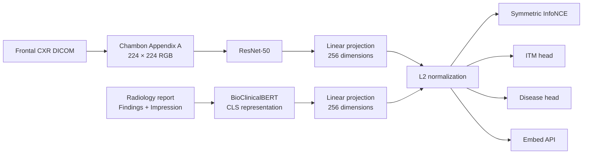
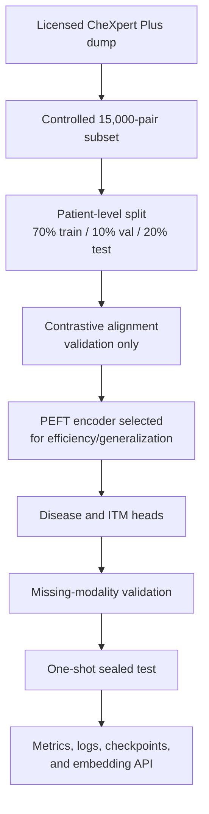

<div align="center">

# RadPair

**Cross-Modal Alignment and Unified Representation Methods for Medical Imaging and Clinical Text Data**

[](#run-and-evaluate)
[](#method)
[](#method)
[](#method)
[](#method)

Contrastive InfoNCE · Unified 256-D embeddings · U-Ignore · Missing-modality

[Project page](https://codewith-rafi.github.io/radpair/)

</div>

## Overview

RadPair asks a narrow, testable question: **on a controlled 15,000-study CheXpert Plus subset, can a lightweight ResNet-50 + BioClinicalBERT dual encoder learn useful chest X-ray–report alignment without training a new foundation model?**

The project evaluates bidirectional retrieval, image–text matching, 14-label disease classification, label uncertainty, and missing-modality behavior under one patient-level protocol. It deliberately reports chance and shuffled-pair baselines, a three-way adaptation comparison, two ablations, and a one-shot held-out test.

This is a research package, not a clinical product. The public export contains code, configuration, logs, and metrics, but no patient-level images, report text, manifests, or model binaries.

## Research Design

### Scientific Motivation

Chest X-ray–report alignment is difficult because reports are long, frequently negative, and partly templated. A contrastive model can therefore retrieve a plausible report without aligning the image to the specific study. RadPair addresses this by combining:

- **Controlled scale:** 15,000 frontal study pairs rather than an opaque large-scale run.
- **Patient-level separation:** no patient is shared across train, validation, or test.
- **Honest retrieval baselines:** exact-gallery chance and shuffled-pair checks accompany Recall@K.
- **Declared uncertainty policy:** uncertain CheXpert labels are masked with U-Ignore before test use.
- **Adaptation spectrum:** frozen, parameter-efficient, and partially end-to-end recipes are compared.
- **Reusable output:** normalized 256-dimensional image and text embeddings with a documented API.

### Architecture



### Experimental Protocol



The disease auxiliary head is trained after contrastive alignment on frozen PEFT embeddings. This is a staged auxiliary-task protocol rather than a joint multi-loss optimization.

### Coverage Matrix

| Research requirement | Implementation | Evidence |
|---|---|---|
| Chest X-ray and corresponding report input | One frontal image per study; Findings + Impression text | `chexpert_plus_subset/subset_summary.json` |
| Image encoder, text encoder, projection | ResNet-50, BioClinicalBERT, 256-dimensional projections | `src/models/dual_encoder.py` |
| Contrastive learning | Symmetric InfoNCE with fixed temperature 0.07 | `src/losses/infonce.py` |
| Cross-modal retrieval | Image→text and text→image Recall@1/5/10 | `experiments/plus_sealed_test_001/metrics.json` |
| Image–text matching | Concatenation MLP with in-batch negatives | `experiments/plus_itm_001/metrics.json` |
| Three comparison groups | Frozen projections, text-only LoRA PEFT, partial end-to-end | `experiments/README.md` |
| Label uncertainty | U-Ignore masks uncertain labels in BCE loss and metrics | `src/data/dataset.py` |
| Disease auxiliary classification | 14-label masked BCE head on image embeddings | `experiments/plus_disease_bce_001/metrics.json` |
| Missing-modality analysis | Same disease head evaluated image-only and text-only | `experiments/plus_missing_modality_001/metrics.json` |
| Two ablations | Findings-only text; PEFT on versus off | `experiments/README.md` |
| Preprocessing and patient split | Chambon Appendix A DICOM cache; 70/10/20 patient split | `chexpert_plus_subset/README.md` |
| Test metrics | Recall@K, AUROC, macro-F1 on 3,189 held-out pairs | `experiments/README.md` |
| Unified embedding interface | `load_dual_encoder`, `embed_image`, `embed_text` | `docs/embed_api.md` |
| Single-GPU, no foundation-model training | Controlled subset and adaptation recipes above | `configs/` |
| Data governance | No public patient images, report text, or manifests | `.gitignore` |

## Method

### Data

| Item | Value |
|---|---:|
| Source | [CheXpert Plus](https://stanfordaimi.azurewebsites.net/datasets/5158c524-d3ab-4e02-96e9-6ee9efc110a1), accessed under its license |
| Controlled subset | 15,000 frontal study pairs |
| Unique patients | 4,965 |
| Split | Patient-level 70 / 10 / 20 |
| Train / validation / test | 10,293 / 1,518 / 3,189 pairs |
| Seed | 42 |
| Text fields | Findings + Impression |
| Labels | 14 CheXbert observations |
| Uncertainty policy | U-Ignore |
| Image preprocessing | Chambon Appendix A DICOM → 8-bit JPG → 224 × 224 RGB |

### Adaptation Groups

| Group | Trainable components | Trainable parameters | Role |
|---|---|---:|---|
| G_frozen | Image/text projections only | 721,408 | Minimal adaptation baseline |
| PEFT | ResNet frozen; LoRA on BioClinicalBERT query/value; projections | 1,016,320 | Efficiency/generalization trade-off and share default |
| Partial e2e | ResNet layer 4; BioClinicalBERT last six layers; projections | 58,803,968 | Stronger adaptation and overfitting probe |

All groups use the same split, preprocessing, loss, batch size, maximum epochs, and validation-based early stopping. The partial end-to-end group is not full backbone fine-tuning.

### Evaluation Safeguards

- Training and model selection use validation only.
- Test rows are refused by the standard data loader unless the evaluation script explicitly enables test access.
- Retrieval is compared with exact-gallery chance and a five-run shuffled-pair control.
- Disease metrics use the predeclared U-Ignore mask.
- After validation-only selection, the held-out test is evaluated once with the selected PEFT encoder plus disease and ITM heads; it reports retrieval, disease AUROC/F1, and ITM from that single run.
- Those test metrics are not used for tuning.

## Results

### Validation — Three-Way Contrastive Comparison

Chance Recall@1 is 1 / 1,518 ≈ 0.000659.

| Group | Best epoch | Val i2t R@1 | Val t2i R@1 | Train@best i2t | Interpretation |
|---|---:|---:|---:|---:|---|
| G_frozen | 7 | 0.01054 | 0.00922 | 0.0586 | Stable but weak alignment |
| PEFT | 11 | 0.01910 | 0.01910 | 0.1738 | Stronger signal with modest overfitting |
| Partial e2e | 10 | 0.02503 | 0.02503 | 0.7559 | Best validation score, largest train–validation gap |

PEFT is the shared default because it provides most of the practical alignment gain with roughly 1.7% of the trainable parameters in the partial end-to-end recipe and a smaller train–validation gap. It is not selected solely because it has the highest validation Recall@1.

### Held-Out Results

The sealed test contains 3,189 pairs. Chance Recall@1 is 0.000314; the mean shuffled i2t Recall@1 is 0.000439.

| Task | Metric | Value |
|---|---|---:|
| Image→text retrieval | R@1 | 0.00878 |
| Image→text retrieval | R@5 | 0.03857 |
| Image→text retrieval | R@10 | 0.05864 |
| Text→image retrieval | R@1 | 0.01035 |
| Text→image retrieval | R@5 | 0.04265 |
| Text→image retrieval | R@10 | 0.07244 |
| Disease, image-only | macro-AUROC | 0.71172 |
| Disease, image-only | macro-F1 | 0.20448 |
| Disease, text-only | macro-AUROC | 0.85892 |
| Disease, text-only | macro-F1 | 0.48181 |
| Image–text matching | AUROC | 0.69425 |
| Image–text matching | Accuracy | 0.64189 |

### Ablations

| Ablation | Comparison | Validation result |
|---|---|---|
| A2: adaptation on/off | G_frozen versus PEFT, same Findings + Impression recipe | i2t R@1 0.01054 → 0.01910 |
| A1: text section | Findings + Impression versus Findings-only | Findings-only i2t R@1 0.03297 on 364 validation pairs |

The findings-only ablation uses a smaller validation gallery and a different sample availability rule, so its absolute Recall@1 is not directly comparable with the main validation table. It is approximately 12× its own chance level of 0.00275.

### Interpretation

- Retrieval is well above chance and the shuffled control, but absolute Recall@1 remains low. This is expected for a controlled 15,000-pair subset and an exact-study gallery.
- Partial end-to-end training achieves the best validation retrieval score but shows clear memorization risk.
- Text-only disease performance is much higher because the 14 labels are derived from report text; this is not evidence that text embeddings are clinically superior to image embeddings.
- The results support a documented research pipeline and a usable shared embedding, not diagnostic deployment.

## Data Governance

- Obtain [CheXpert Plus](https://stanfordaimi.azurewebsites.net/datasets/5158c524-d3ab-4e02-96e9-6ee9efc110a1) directly from Stanford AIMI and comply with its access terms.
- Set `CHEXPERT_PLUS_ROOT` to the licensed local dump.
- Never commit patient-level images, DICOM files, report-text CSVs, manifests, or derived patient identifiers.
- The repository intentionally ships only aggregate metadata and experiment results.


## Run and Evaluate

### Prerequisites

- A licensed CheXpert Plus download, including the source CSV, DICOM files, and CheXbert label file.
- The local, non-public `chexpert_plus_subset/manifest.csv` created for this study.
- One CUDA-capable GPU.
- Python 3.11 and a virtual environment.
- The pinned PyTorch and torchvision wheels target CUDA 12.8; install matching wheels for your platform before `pip install -r requirements.txt`.

Running the study requires the licensed source and the study's local subset manifest. Patient-level files are intentionally not redistributed.

### Environment

```bash
git clone <your-fork-or-mirror-url> radpair
cd radpair
python -m venv .venv
source .venv/bin/activate

# Install the PyTorch wheels for your platform first, then:
pip install -r requirements.txt
huggingface-cli download emilyalsentzer/Bio_ClinicalBERT \
  --local-dir models/Bio_ClinicalBERT

export RADPAIR_ROOT="$(pwd)"
export CHEXPERT_PLUS_ROOT=/path/to/chexpert_plus
```

### Data Build

```bash
python scripts/write_plus_split_manifest.py \
  --split train --out data/processed/plus_train_manifest.csv
python scripts/write_plus_split_manifest.py \
  --split val --out data/processed/plus_val_manifest.csv

python scripts/join_plus_chexbert_and_stats.py
python scripts/build_plus_test_manifest.py

# Cache train/validation images.
python scripts/cache_plus_chambon_jpg.py

# Cache held-out test images through the same preprocessing path.
python scripts/cache_plus_chambon_jpg.py \
  --train_manifest data/processed/plus_test_manifest.csv \
  --val_manifest data/processed/plus_test_manifest.csv
```

### Training and Evaluation

```bash
export CUDA_VISIBLE_DEVICES=0

# Three comparison groups.
python scripts/train_plus_g1.py --config configs/plus_g1.yaml
python scripts/train_plus_g_peft.py --config configs/plus_g_peft.yaml
python scripts/train_plus_g_e2e.py --config configs/plus_g_e2e.yaml

# Auxiliary heads on frozen PEFT embeddings.
python scripts/train_plus_disease.py --config configs/plus_disease.yaml
python scripts/train_plus_itm.py --config configs/plus_itm.yaml

# Validation analyses.
python scripts/eval_plus_missing_modality.py \
  --config configs/plus_missing_modality.yaml

# One-shot held-out evaluation after all choices are fixed.
python scripts/eval_plus_sealed_test.py \
  --config configs/plus_sealed_test.yaml
```

To regenerate the reported tables without retraining, place your locally stored checkpoints under the corresponding experiment directories and verify their SHA256 hashes before use.

## Embedding API

```python
from transformers import AutoTokenizer
from src.api import load_dual_encoder, embed_image, embed_text

device = "cuda:0"
model = load_dual_encoder(device=device)
tokenizer = AutoTokenizer.from_pretrained(
    "models/Bio_ClinicalBERT", local_files_only=True
)

# Image caller supplies ImageNet-normalized (B, 3, 224, 224) tensors.
image_embedding = embed_image(model, pixel_values)

# Text caller supplies token IDs and attention masks.
text_embedding = embed_text(
    model,
    batch["input_ids"].to(device),
    batch["attention_mask"].to(device),
)
```

Both functions return L2-normalized 256-dimensional embeddings. See `docs/embed_api.md` for checkpoint behavior, preprocessing ownership, and PEFT loading details.

## Repository Map

| Path | Contents |
|---|---|
| `src/models/` | Dual encoder, disease head, and ITM head |
| `src/losses/` | Symmetric InfoNCE and masked BCE |
| `src/data/` | Manifest loading, U-Ignore parsing, and preprocessing |
| `src/eval/` | Recall@K implementation |
| `src/api/` | Reusable embedding interface |
| `scripts/` | Data, training, and evaluation entry points |
| `configs/` | Run configurations |
| `experiments/` | Metrics, logs, configuration snapshots, and consolidated result tables |
| `chexpert_plus_subset/` | Public-safe aggregate metadata only |
| `docs/` | API documentation and visual-asset guidance |

## Contact

**Rafi Ahmed**  
Research Assistant, Machine Intelligence Lab, Sichuan University  
[codewithrafi@outlook.com](mailto:codewithrafi@outlook.com) · [GitHub](https://github.com/codewith-rafi) · [www.machineilab.org](https://www.machineilab.org)

## References

1. A. Radford et al., “Learning Transferable Visual Models From Natural Language Supervision,” in *Proc. ICML*, 2021 (CLIP).

2. Y. Zhang, H. Jiang, Y. Miura, C. D. Manning, and C. P. Langlotz, “Contrastive Learning of Medical Visual Representations from Paired Images and Text,” in *Proc. Machine Learning for Healthcare (MLHC)*, 2022 (ConVIRT).

3. S.-C. Huang, L. Shen, M. P. Lungren, and S. Yeung, “GLoRIA: A Multimodal Global-Local Representation Learning Framework for Label-efficient Medical Image Recognition,” in *Proc. ICCV*, 2021.

4. E. Tiu, E. Talius, P. Patel, C. P. Langlotz, A. Y. Ng, and P. Rajpurkar, “Expert-level detection of pathologies from unannotated chest X-ray images via self-supervised learning,” *Nature Biomedical Engineering*, vol. 6, pp. 1399–1406, 2022 (CheXzero).

5. P. Chambon, J.-B. Delbrouck, T. Sounack, S.-C. Huang, Z. Chen, M. Varma, S. Q. Truong, C. T. Chuong, and C. P. Langlotz, “CheXpert Plus: Augmenting a Large Chest X-ray Dataset with Text Radiology Reports, Patient Demographics and Additional Image Formats,” arXiv:2405.19538, 2024.

6. J. Irvin et al., “CheXpert: A Large Chest Radiograph Dataset with Uncertainty Labels and Expert Comparison,” in *Proc. AAAI*, 2019.

7. K. You, J. Gu, J. Ham, B. Park, J. Kim, E. K. Hong, W. Baek, and B. Roh, “CXR-CLIP: Toward Large Scale Chest X-ray Language-Image Pre-training,” in *Proc. MICCAI*, 2023.

8. Z. Wang, Z. Wu, D. Agarwal, and J. Sun, “MedCLIP: Contrastive Learning from Unpaired Medical Images and Text,” in *Findings of EMNLP*, 2022.
